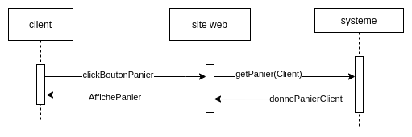

# Cahier des charges fonctionnel

## Entête

- Groupe de TD : 4
- Date de démarrage : 10/10/2022

| Nom     | Prénom | mail                              |
| ------- | ------ | --------------------------------- |
| Gouraud | Romain | romain.gouraud@etu.univ-nantes.fr |
| Brevet  | Noa    | noa.brevet@etu.univ-nantes.fr     |
| Seac'h  | Adrien | adrien.seac-h@etu.univ-nantes.fr  |
| Garnier | Eloi   | eloi.garnier@etu.univ-nantes.fr   |
| Meunier | Mathys | mathys.meunier@etu.univ-nantes.fr |

## 1. Présentation générale du problème

### 1.1 Projet

#### 1.1.1 Finalités

Une société souhaite une refonte de son système d’information (SI) et l’automatisation d’une partie du SI, avec principalement la création d’un site  de présentation et de ventes de produits en lignes. Le site devra être hébergé sur des serveurs. La société sera responsable des serveurs et du déploiement de l’application sur ces derniers. L’ensemble devra répondre aux contraintes de sécurité, de performance et aux aspects juridiques sur la protection des données.

#### 1.1.2 Espérance de retour sur investissement

Créer de la visibilité pour notre entreprise en valorisant nos compétences et ainsi se créer une réputation et viser une expansion sur long terme.

### 1.2 Contexte

#### 1.2.1 Situation du projet par rapport aux autres projets de l’entreprise

Ce projet, est le seul projet de notre entreprise à cet instant.

#### 1.2.2 Suites prévues

Une maintenance du site, est prevu.

#### 1.2.3 Nature des prestations demandées

-Developpement web

-Architecture d'un réseau

-Création d'une base de donnée

#### 1.2.4 Parties concernées par le déroulement du projet et ses résultats (demandeurs, utilisateurs)

L'interface utilisateur est directement liée à la réussite du projet. Le bon fonctionnement de l'entreprise cliente sera bien sur affetcé par la création d'un système d'information performent.            

#### 1.2.5 Caractère confidentiel s'il y a lieu

Les données utilisateurs sauvegarder dans notre base de données sont à carectères confidentielle. 

### 1.3 Énoncé du besoin

-Création d'un sytème d'information et l’automatisation d’une partie du SI, avec principalement la création d’un site

## 2. Expression du besoin

### 2.1 Cadrage du projet

#### 2.1.1 Note de cadrage

#### 2.1.2 Analyse systémique (approche systémique)

#### 2.1.3 Modèle de processus (conceptuel)

#### 2.1.4 Modèle organisationnel

### 2.2 Exigences du clients

### 2.2.1 Exigences structurelles

**Diagramme de classes d'analyse** :

**Diagrame de classe participantes** : 

//TODO

### 2.2.2 Exigences foncitionnelles

**tableau des fonctions**:

| Fonction                        | Importance | Critère d’appréciation                                     | Niveau d'appréciation | Niveau de flexibilité |
| ------------------------------- | ---------- | ---------------------------------------------------------- | --------------------- | --------------------- |
| Maintenance du catalogue        | 5          | action répercutante sur produit                            | 4 actions possibles   | +/- 1                 |
| Consulter le panier             | 4          | temps de chargement(sec)                                   | moins d'une seconde   | +/- 0                 |
| Valider panier(payer,commander) | 5          | nombre étape                                               | 2 étapes              | +/- 1                 |
| Maintenance de son profil       | 3          | action répercutante sur profil                             | 3 actions possibles   | +/- 1                 |
| Recherche produit               | 3          | nombre de critère disponible                               | 5 critères            | +/- 2                 |
| S'authentifier                  | 4          | temps de chargement de la version personalisé du site(sec) | 2 sec                 | +/- 1                 |
| Gestion des utilisateurs        | 3          | action répercutante sur la base de donées des utilisateurs | 2 actions             | +/- 0                 |

Le **Diagramme de cas d’utilisation**:

### 2.2.1 Maintenance du catalogue

#### 2.2.1.1 Solution proposée

Description du __scénarios__ de la fonction par un diagramme de séquence:

#### 2.2.1.2 Niveau atteint pour chaque critère d’appréciation de cette fonction et modalités de contrôle

Lors de la conception de cette fonction nous avons le niveau de trois actions répercutante sur le catalogue qui était l'objectif.

### 2.2.2 Consulter Panier

#### 2.2.2.1 Solution proposée

Description du __scénarios__ de la fonction par un diagramme de séquence :

#### 2.2.2.2 Niveau atteint pour chaque critère d’appréciation de cette fonction et modalités de contrôle

//TODO

### 2.2.3 S'authentifier

#### 2.2.3.1 Solution proposée

Description du **scénarios** de la fonction par un diagramme de séquence :

#### 2.2.3.2 Niveau atteint pour chaque critère d’appréciation de cette fonction et modalités de contrôle

//TODO

### 2.2.4 Valider Panier(Payer,Commander)

#### 2.2.4.1 Solution proposée

Description du **scénarios** de la fonction par un diagramme de séquence :

#### 2.2.4.2 Niveau atteint pour chaque critère d’appréciation de cette fonction et modalités de contrôle

//TODO

### 2.2.5 Rechercher un produit

#### 2.2.5.1 Solution proposée

Description du **scénarios** de la fonction par un diagramme de séquence :

#### 2.2.5.2 Niveau atteint pour chaque critère d’appréciation de cette fonction et modalités de contrôle

//TODO

### 2.2.6 Maintenance de son profil

#### 2.2.6.1 Solution proposée

Description du **scénarios** de la fonction par un diagramme de séquence :

#### 2.2.6.2 Niveau atteint pour chaque critère d’appréciation de cette fonction et modalités de contrôle

//TODO

### 2.2.7 Gestion des utilisateurs

#### 2.2.7.1 Solution proposée

Description du **scénarios** de la fonction par un diagramme de séquence :

#### 2.2.7.2 Niveau atteint pour chaque critère d’appréciation de cette fonction et modalités de contrôle

//TODO

## 4 Prévisions de fiabilité – Gestions des risques

### 4.1 Risques à la réalisation

#### Tableau de profil de risques pour nos fonctions :

#TODO

### 4.2 Prévision des défaillances

#### Table de défaillance pour nos fonctions :

##### Table de défaillance de la fonction Une fonction:

| Défaillances possibles | Causes potentielles | Effets potentiels des défaillances | Commment détecter ces défaillances |
| ---------------------- | ------------------- | ---------------------------------- | ---------------------------------- |
|                        |                     |                                    |                                    |
|                        |                     |                                    |                                    |

##### Table de défaillance de la fonction Une autre fonction:

| Défaillances possibles | Causes potentielles | Effets potentiels des défaillances | Commment détecter ces défaillances |
| ---------------------- | ------------------- | ---------------------------------- | ---------------------------------- |
|                        |                     |                                    |                                    |
|                        |                     |                                    |                                    |

##### Table de défaillance de la fonction Une autre fonction:

| Défaillances possibles | Causes potentielles | Effets potentiels des défaillances | Commment détecter ces défaillances |
| ---------------------- | ------------------- | ---------------------------------- | ---------------------------------- |
|                        |                     |                                    |                                    |
|                        |                     |                                    |                                    |

##### Table de défaillance de la fonction Une autre fonction:

| Défaillances possibles | Causes potentielles | Effets potentiels des défaillances | Commment détecter ces défaillances |
| ---------------------- | ------------------- | ---------------------------------- | ---------------------------------- |
|                        |                     |                                    |                                    |
|                        |                     |                                    |                                    |
|                        |                     |                                    |                                    |

#### Matrice de criticité:

##### 

## 5 Annexe

*Le planning ne fait pas partie de la norme car sa décomposition n’importe pas au client à cette phase du projet. Il n’est alors intéressé que par les jalons qui ponctuent la réalisation des différentes fonctionnalités.
Nous placerons donc le __diagrammes de Gantt__ ici.*
