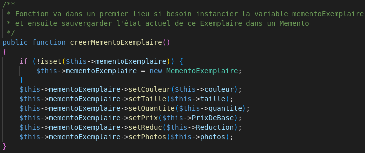

# **Compte Rendu SAE3 + R3.04**
*Adrien Séac'h, Eloi Garnier, Mathys Meunier, Romain Gouraud, Noa Brevet*

  **Pour notre application, nous avons mis en place trois types différents de Design Pattern:**
   - Singleton
   - Delegate
   - Memento

## **Singleton**

 - **Pourquoi et où?**  
  Le Singleton de notre projet est la classe *CatalogueEntity*. Du point de vue du projet, le catalogue est ce qui contient toutes les catégories différentes et donc tous les exemplaires que notre site propose. Il paraît donc évident qu'il ne doit en exister qu'un seul.

 - **Comment?**   
  L'implémentation d'un Singleton en php est différente que celle en kotlin. En effet, il n'y a pas de "companion object" en php, c'est pourquoi tout ce qu'on aurait écrit dans le "companion object", se retrouve dans la classe elle-même, comme n'importe quelle méthode/variable.  
   - *CatalogueEntity()*

     - variable _instance:  
      

     - fonction getInstance():  
       

     - constructeur en privé:  
      

   - *AdministrateurEntity()*  

     - exemple d'appel de *CatalogueEntity* dans *AdministrateurEntity*:  
       

## **Delegate**
 - **Pourquoi et où?**  
 Notre projet contient une multitude de Delegate. En effet, dans sa structure, le catalogue contient plusieurs catégories qui eux même contiennent plusieurs exemplaires. Donc lorsqu'un élément veut manipuler un autre qu'il contient, il va juste chercher où appeler puis va déléguer la tâche, pour que le concerné puisse s'occupe de lui-même.

 - **Comment?**  
 Le fonctionnement de chaque méthode Delegate suit toujours le même patterne. La méthode va premièrement chercher à trouver où/qui appeler grâce au(x) paramètre(s), et ensuite appeler une méthode de l'objet.  

   - Dans le schéma ci-dessous, les flèches indiquent vers quelle méthode de la classe *CategorieEntity*   délègue une méthode de la classe *CatalogueEntity*.  
     

   - Exemple de délégation
     - *CatalogueEntity*  
        

     - *CategorieEntity*  
      
 

## **Memento**  
 - **Pourquoi et où?**  
 Dans notre projet, il y a deux implémentations de Memento Pattern, un pour *ProduitEntity* et un pour *ExemplaireEntity*. Si l'on modifie un exemplaire ou un produit, mais que la modification ne nous satisfait pas au finale, il serait facile de ne pas se rappeler dans quel état serait ces éléments avant modification. Au lieu, de forcer à rechercher à taton cet état post-modification, le Memento Pattern nous permet de le récupérer beaucoup plus facilement.  
 - **Comment?**  
 Chacune des implémentations de Memento de notre projet a été conçu de la même manière.  

   Une classe dite 'Memento', qui contient les même variables en privées que la classe d'origine, sauf ses invariants comme les ID. Elle contient aussi les getters et les setters de ces variables privées.  

   Une classe dite 'originel' (celle qui nécessite le Memento) qui contient une variable qui contient soit rien, soit une instance de Memento, une méthode pour créer une instance de Memento à partir de son état présent et une autre méthode qui va rétablir la classe grâce au Memento qu'elle a enregistré au préalable.

   - *MementoExemplaire()*  

     - UML de la classe:  
       

   - *MementoProduit()*  
     

   - *ProduitEntity()*
     - variable mementoProduit:  
       
     - méthode creerMementoProduit():  
       
     - méthode restoreProduit():  
     
     - méthode creerMementoExemplaire():  
       
     - méthode restoreExemplaire():  
       

## Conclusion  

Durant ce projet, nous avons rencontré divers problème qu'il nous aurait pris beaucoup de temps à résoudre. Mais grâce aux Design Pattern, nous avons su trouver une réponse simple et optimisé.  